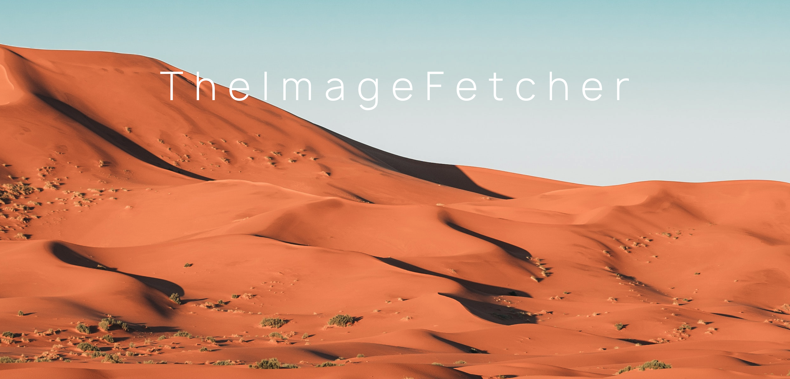

<p align="center">
    <br>
    
    <br>
<p>

# TheImageFetcher (still compatible in 01/2022)
TheImageFetcher is a high-performance tool that allows you to quickly extract large amounts of images from Google Images. Depending on the internet connection, it is possible to fetch over 70 high-resolution images within seconds. The tool allows to save the URLs of these images in an external text file and to specify the path where the images should be saved for a search query. 

## Why should you use TheImageFetcher?

If large amounts of image data are needed to train neural networks in the context of image recognition, Google is of course the best source. TheImageFetcher is very easy to use and is also adapted to the 2021 version of Google Images! 

## Requirements

* python3
* Install all required packages
* [Chrome Driver](https://chromedriver.chromium.org/) - Please make sure to download chromedriver for your currently installed Google Chrome version.

That's it! Just place your chromedriver anywhere you want. Make sure to that you can copy the absolute path of chromedriver!

## How to use

### Install required packages

#### Via requirements.txt
1. run `python -m venv venv`
2. `pip install -r requirements.txt`

#### By Hand With pip
1. run `python -m venv venv`
2. run `pip install bs4`
3. run `pip install selenium`
4. run `pip install requests`
5. run `pip install termcolor`

### Basic Usage

run file`run.py`


```python
from TheImageFetcher import TheImageFetcher as img_fetcher

chromedriver_path = '/Users/Max_Mustermann/Downloads/chromedriver' # your absolute path of chromedriver!
query = "wheaten terrier" # specify the query for which you want to extract the images

img_fetcher.set_chrome_driver(chromedriver_path)
img_fetcher.fetch_images(query)
```

Images are saved with a random id as .jpg in the images folder. 

### (Advanced) Parameters of fetch_images() 

default parameters:

```query, loading_time=5, dir_name="images", create_source_file=False, file_type="jpg", print_progress=True, mode=""```

- `query`: the query for which you want to extract the images
- `loading_time`: the time you want the system to wait until the site has been loaded. This number can be set lower the better your internet connection is.
- `dir_name`: the name of the directory in which you want to store the images
- `create_source_file`: an additional text file can be saved in the root directory, in which the sources of the images are stored.
- `file_type`: specify which filetype you want to story (for example "png" or "jpg")
- `print_progress`: On the one hand, of course, you can see how many images are already in the folder, but on the other hand, you can also display the proportion of images that have already been crawled.
- `search_mode`: add Google-Search paramter. You can find those [here](https://stenevang.wordpress.com/2013/02/22/google-advanced-power-search-url-request-parameters/). For example `"search_mode="&tbs=qdr:m"` as a parameter.
## Future

I will try to make the package accessible via pip.
